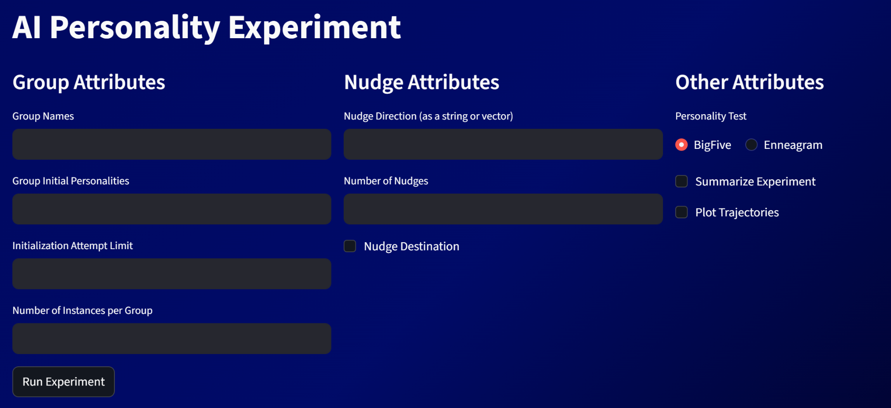
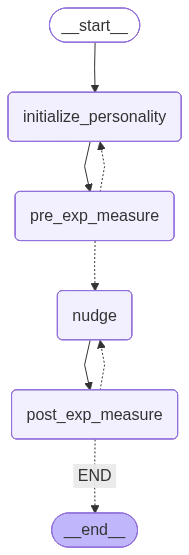
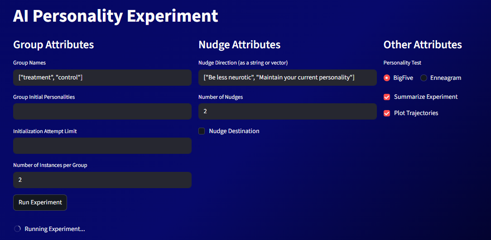

## What it does

Describe your project for a general audience. What problem does it solve? Who is it for?

AI is a new technology that has potential use in a wide variety of fields, particularly due to its role-playing potential (Customer Service, Tech Support, etc.). Much of the 
usefulness of AI is dependent on its personality encompassing certain traits. As such, understanding the malleability of an AI's personality is a critical area of study. To 
address this question, we have developed a tool to study AI personality stability. This project is designed to measure an AI's personality using various personality tests from
psychology literature before and after certain 'nudges' (prompts instructing the AI to behave a certain way). It is set up in a way that allows researchers to conduct 
experiments on AI behavior in response to any given 'nudge'. 

The experimental workflow can be run either through a built-in streamlit interface or through the testRun.py python script. Both call the same underlying langraph workflow, which is designed to be flexible and customizable based on the researcher's needs. The tool has three main inputs that the researcher can fill in to customize their experiment.

The first input is the 'initial personality' input, which allows the researcher to initialize the AI with a certain personality. This is useful for testing the stability of certain personalities, as well as seeing how different personalities respond to the same nudges.
The second input is the 'nudges' input, which allows the researcher to input a list of nudges that they want to test. The tool will run a personality test on the AI before and after each nudge, allowing the researcher to see how the AI's personality changes in response to each nudge.
The final input is the 'personality test' input, which allows the researcher to choose which personality test they want to use in their experiment. This is useful for testing the stability of certain traits, as well as seeing how different traits respond to the same nudges.
Each of these inputs accepts a variety of formats and input types, allowing the researcher to customize their experiment in a way that best suits their needs. In addition to the main experimental workflow, the tool also has a 'plot trajectories' function that allows the researcher to visualize the changes in the AI's personality over time in response to the nudges. This is useful for seeing how the AI's personality evolves in response to different stimuli, as well as identifying any patterns or trends in its behavior.

This project serves at a tool to study AI personality stability. It is designed to measure an AI's personality using various personality tests from psychology literature. 

## How it works

Langraph Workflow:
The overall structure of the langraph workflow is as follows: start by initializing personality, run a personality test, give a nudge, run a personality test, end (if multiple 
nudges are inputted, repeat the 'nudge and then test' cycle for each nudge). Initializing the personality essentially checks if there was an initialized personality input. If 
there was, the AI is initialized as that personality. If there is no input, it skips to the personality test. The personality test node administers the test to the AI and adds 
its result to the state. The nudge node sends the AI a 'nudge', which is recorded in the chat history. After the workflow is done, it has compiled the desired amount of test 
results in the 'measurements' variable in the state, completing the experiment.

summarize_experiment:
The summarize_experiment function is designed to take in the measurements from the experiment and create a summary of the results. This is useful for quickly understanding the 
overall findings of the experiment, as well as identifying any key takeaways or insights. Summary statistics include things like number of instances, initialization success 
rate, mean nudges performed. 

plot_trajectories:
Once the experiment is done, the researcher can use the 'plot trajectories' function to visualize the changes in the AI's personality over time in response to the nudges. This 
is useful for seeing how the AI's personality evolves in response to different stimuli, as well as identifying any patterns or trends in its behavior. The plot trajectories 
function takes in the measurements from the experiment and creates a visual representation of how the AI's personality changed over time. It can plot the trajectories of 
different traits or dimensions of personality, allowing the researcher to see how each trait evolved in response to the nudges. This can help the researcher identify any 
patterns or trends in the AI's behavior, as well as see how different traits interacted with each other over time.

Tools:
measure_personality - The measure_personality tool utilizes structured output to give the AI a given personality test (BigFive/Enneagram), and record its score. It does this by
creating an structured output measure using IntEnum (for the BigFive test this would be a Likert scale). This structured output is then integrated in a BaseModel structured 
output consisting of each question to be asked. The responses to each question are recorded as a number and summed up to create the test result (in vector form). The 
personality tests queries are not included in the chat history given to the AI to avoid any kind of bias it may receive when give subsequent tests.

have_sim_personality - The have_sim_personality tool measures the difference between two personalities using the gaussian kernel measure. It has an input that the researcher 
can fill in to indicate the threshold at which two personalities can be deemed 'similar'. It also has a sigma input that can be tuned based on what works best for the given 
personality space.

get_prompt_from_vector - This tool takes in a personality vector and creates a prompt that can be given to the AI to nudge it towards that personality. It does this by taking the 
vector and converting it into a prompt format that the AI can understand. This allows the researcher to create nudges that are specifically designed to nudge the AI towards a 
certain personality.

 

## Team

- Wyatt Snyder
- Eli Edwards-Parker
